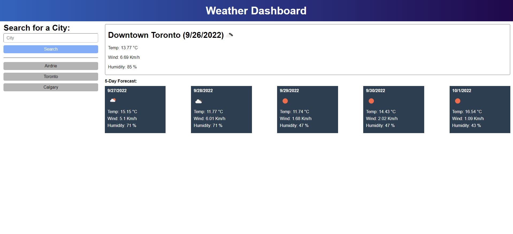

# Web Dev Quiz

## Description

This webpage displays weather for the areas you input. By default the webpage displays the weather for Toronto, CA.

## Installation

This webpage can be accessed by going to https://canadianmre.github.io/Weather-Viewer-C6

## Usage

To use this webpage, simply enter the name of a city into the search field and hit search. You can also click the grey buttons below the search bar to display the city shown.

## Image

## Credits

Made by CanadianMRE(Jaymen Laton)
